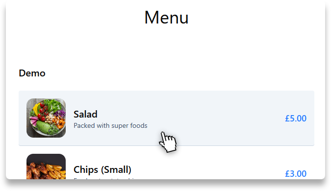

# Flipdish Frontend Assessment

A responsive menu application utilising a mock API provided by Flipdish.

<h4 align="center">
    <a href="https://clearscore-idea-board.vercel.app" target="_blank">Demo</a>
    
</h4>

## Information

A technical assessment provided by Flipdish to utilise an example API to provide a menu to the consumer.

**Features:**

- Menu to contain sections (Mains, Desserts etc.) and items within those sections.
- Show the following if the API provides them: name, image, description and price.
- Conditional rendering of items depending on whether the options provided are to be standalone or not.
- Responsive design for both mobile and desktop.

## Installation

`npm i` - install dependencies (run this at the project root)

`npm run dev` - start the local development server

`npm run build` - generates the build directory which contains the production build of the application
